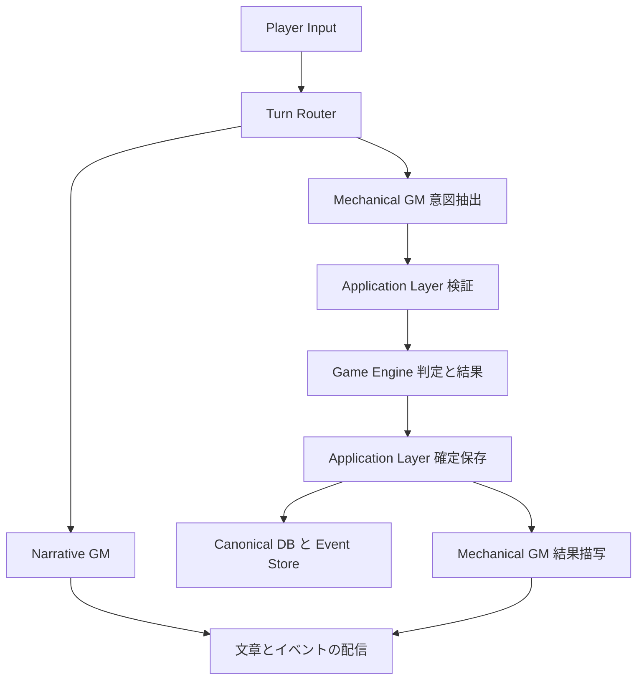
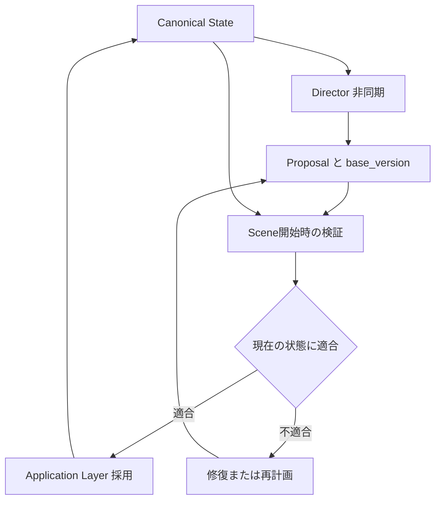

# AI TRPG アーキテクチャ仕様書

バージョン: 0.1  
作成日: 2026-09-14  
ステータス: 仕様固定前の合意事項整理

> **決定の更新:** 本書で「候補」「未確定」「要決定」とした項目のうち、技術選定、MVP ruleset、実行時初期値、Turn routing、principal境界は [Architecture Decision Records](adr/README.md) で決定済みである。矛盾する場合は採用状態のADRを優先する。

## 1 目的と仕様の位置付け

AIをゲームマスターとして利用するTRPGシステムについて、これまで合意したアーキテクチャを整理する。中心となる原則は、LLMが意図の解釈と描写を担い、Game Engineがルールと結果を決定し、DBに保存した確定状態をゲーム上の真実とすることである。

本書は実装詳細の最終確定版ではない。「合意済み」は採用方針への合意を示し、具体的な型・テーブル・APIまで確定したことを意味しない。「要決定」は提案段階であり、実装者が独断で固定しない。

参照範囲は、この会話に共有された議論である。省略された以前の議論にある技術選定などは、確認なしに決定済みとして補完しない。

## 2 固定する基本原則

| 項目 | 合意済みの原則 |
| --- | --- |
| LLMの責務 | プレイヤー入力の解釈、解決したい意図の構造化、結果の描写 |
| Game Engineの責務 | ルール適用、判定、乱数、ダメージなどの結果決定 |
| ゲーム上の真実 | DB由来の確定状態をCanonical Stateとする |
| 状態変更権限 | LLMに直接の状態変更権限を与えない |
| レイヤー分離 | LLMレイヤーとゲームレイヤーを分離する |
| 障害分離 | 文章生成の失敗とゲーム処理の成否を分離する |
| 再送 | 同じ行動を二重適用しない |
| 再現性 | ダイスを含むゲーム処理をテストで再現できるようにする |
| 初期スコープ | ContextとMemoryは最小実装とし、拡張可能な境界を用意する |

LLMが「敵を倒した」と描写しても、確定状態でHPが残っていれば撃破とは扱わない。反対に、確定状態と矛盾する描写はLLM出力側の不整合として扱う。

## 3 論理構成と責務

以下は責務の構成であり、別サービスへの分割やデプロイ単位を指定するものではない。

| コンポーネント | 責務 | 制約 |
| --- | --- | --- |
| Turn Router | NarrativeとMechanicalへの振り分け | ルールベースを基本とし、必要時のみLLM補助 |
| Narrative GM | 通常の会話・場面描写・選択肢生成 | Canonical Stateを直接変更しない |
| Mechanical GM | ルール処理が必要な意図の抽出と結果描写 | 判定結果や更新後の状態を決めない |
| Application Layer | 意図の検証、ゲーム処理の呼び出し、保存と権限の仲介 | LLM出力をそのままDB更新に変換しない |
| Game Engine | 検証済みの行動をルールに従って解決 | LLMなしでも実行・テスト可能にする |
| Dice Engine | ダイス処理と結果記録 | 乱数はゲーム側で管理する |
| Context Builder | 各GMに渡す情報の組み立て | 確定状態、アクセス範囲、信頼区分を考慮 |
| Canonical DB | 確定した世界とキャラクターの状態を保持 | 更新はゲーム／アプリケーション側で確定 |
| Event Store | ターンとゲーム上の出来事を記録 | Canonical DBとの永続化方式は要決定 |
| Director | バックグラウンドで展開や計画を生成 | Canonicalは読み取りのみ、変更はProposal経由 |
| Proposal Store | Directorの未採用計画を保持 | 確定状態とは区別する |

### 3.1 同期ターンの処理関係

図は論理的な処理順を示す。DBとEvent Storeの物理構成、トランザクション単位、配信機構は未確定である。Narrativeで世界の事実やScene変更を提案する場合の採用経路も、詳細仕様で定義する。

## 4 Turn Router と LLM呼び出し予算

Scene GMをNarrative GMとMechanical GMの2種類に分ける。

| 種別 | 呼び出し予算 | 通常経路 |
| --- | --- | --- |
| Narrative | 最大1回 | 描写や応答を生成する |
| Mechanical | 最大3回 | 意図抽出と結果描写の通常2回、修復用に1回を確保 |
| Director | 同期ターンの予算対象外 | 非同期ジョブとして実行し、インフラ上の上限を設定 |

Mechanicalの3回目は非常口であり、通常経路として常用しない。スキーマ不正、文脈不整合などを修復するための枠とする。

振り分けの初期規則、分類不能入力の安全条件、Narrativeからの昇格は [ADR-0009](adr/0009-turn-routing.md) で決定する。

呼び出しの数え方、retry、timeout、初期予算は [ADR-0008](adr/0008-runtime-defaults.md)、昇格と複合行動を含むrouteは [ADR-0009](adr/0009-turn-routing.md) で固定する。Directorのjob予算は同期Turnと分離し、後続仕様で決定する。

## 5 LLMとの入出力契約

### 5.1 合意済みの境界

LLMは「何を解決してほしいか」「そのために何が必要か」を最小限の構造化出力として返す。Game Engineが「実際どうなったか」を決める。

LLMに自由形式のstate mutationを返させない。ダメージ値、更新後HP、クエスト達成などの確定結果をLLMの権威として採用しない。

### 5.2 スキーマ候補

以下は議論に出たフィールド候補であり、型、必須性、命名、単一／複数行動は未確定。

| 契約 | 主な候補フィールド | 用途 |
| --- | --- | --- |
| PlayerTurn | text、selected_choice_id | プレイヤー入力 |
| NarrativeResult | narration、choices、scene_intent | 描写、選択肢、Sceneに関する提案 |
| MechanicalIntent | action_typeまたはintent、actor_id、target_id、required_data、行動パラメータ | 解決を要求する行動 |
| TurnRecovery | fallback、reason | 障害復旧の有無と理由 |
| ContextFragment | source、trust_level、access_scope | コンテキストの出所と扱い |

Mechanicalの行動種別としてattack、skill_check、saving_throw、use_itemなどが候補にある。required_dataはactor_status、target_status、weapon、sceneなどの必要情報を表す。要求された情報を無条件で渡す意味ではなく、アクセス可否の判断はアプリケーション側に残す。

実装詳細では、IDの存在・操作権限・対象の合法性・パラメータの妥当性を検証する契約を定義する必要がある。未制限のdictやotherは、そのまま自由なゲーム操作権限にしない。

## 6 Context Builder

Contextは全履歴の投入に依存せず、アプリケーション側のContext Builderが必要な情報を組み立てる。Providerを追加できるPlugin型の構成を採用する。

### 6.1 実装範囲

| Provider | 導入時期 | 内容 |
| --- | --- | --- |
| CurrentSceneProvider | MVP | 現在のScene |
| PCStatusProvider | MVP | PCの確定状態 |
| RecentMessagesProvider | MVP | 最近のメッセージ |
| NearbyEntitiesProvider | 将来 | 周囲のNPCやエンティティ |
| QuestProvider | 将来 | 進行中のクエスト |
| EpisodeMemoryProvider | 将来 | 関連する過去の出来事 |
| LoreProvider／LoreRAGProvider | 将来 | 世界設定の検索 |
| NPCMemoryProvider | 将来 | NPCごとの記憶 |

インターフェースの方向性は、ContextRequestを受け取りContextFragmentまたはNoneを返す非同期Providerとする。具体的な型、Contextのトークン予算、切り詰め順序、Provider失敗時の扱いは要決定。

### 6.2 信頼レベル

| 区分 | 例 | 扱い |
| --- | --- | --- |
| TRUSTED | Engineが管理するID、HP、能力値、システム所有フラグ | アプリケーション管理下の確定データ |
| DERIVED | AI生成の要約や記憶 | 派生情報であり、Canonicalの代替ではない |
| UNTRUSTED | プレイヤー入力、外部文章、インポートシナリオ、ユーザー作成NPC説明 | データとして扱い、指示権限を与えない |

現在のSceneや最近のメッセージにも未信頼テキストが含まれ得る。DBに保存されているという理由だけで、自由記述を信頼済みの指示に昇格させない。

詳細な防御機構は将来拡張とするが、MVPでもシステム指示とデータの境界、およびLLMにCanonical更新権限を与えない境界は維持する。区切りタグや注意書きだけで完全防御できるとは扱わない。

## 7 Memory と Agent権限

記憶の検索用途とゲーム上の真実を分離する。world_facts、character_facts、episode_memories、scene_summariesなどは論理的な分類候補であり、物理テーブルはまだ固定しない。

レイヤーとAgentごとのアクセス範囲を分ける方針は合意済み。次表は会話で採用された権限方針を、SceneGMをNarrative GMに読み替えて整理したもの。

| 領域 | Narrative GM | Mechanical GM | Director |
| --- | --- | --- | --- |
| Canonical | 読取 | 読取 | 読取 |
| Scene | 読取 | 読取 | 読取と書込提案 |
| Episode | 読取 | 不可 | 読取と書込提案 |
| Private DM | 不可 | 不可 | 読取と書込提案 |
| Player Notes | 読取 | 不可 | 読取 |
| Rules | 読取 | 読取 | 読取 |

読取は領域全体の無制限公開を意味しない。Campaignや担当範囲など、許可されたスコープ内に限定する。書込提案はDBへの直接writeではなく、Application Layerによる検証と保存を通す。

将来のNPC Agentは自分の記憶のみを参照し、他NPCの秘密を読めないように拡張できる設計とする。詳細なポリシー実装と各Memory領域の本格導入は後回しにする。

## 8 Director と Proposal

Directorは非同期で動作し、同期ターンの呼び出し予算には含めない。ただし、ジョブ単位のmodel calls、tokens、cost、execution timeに物理的な上限を設ける。閾値はテストと実測に基づいて調整する。

DirectorはCanonical Stateを直接変更しない。計画をProposalとしてdirector_plans相当の領域に保存し、Scene開始時に検証して採用する。

Proposalには参照したworld stateのバージョンを持たせる。適用時にバージョンが変わっていれば再検証し、古い前提の計画を無条件で採用しない。バージョン不一致そのものを必ず不採用とするか、依存対象だけを検証するかは詳細設計で決める。

検証後から採用までの競合防止、ジョブ起動契機、Proposalの有効期限、再計画回数、同時実行数は要決定。

## 9 Model Routing

モデル名をコード内の役割と固定結合せず、設定で切り替える方針を採用する。

| Tier | 用途 |
| --- | --- |
| FAST | 通常の会話など |
| QUALITY | 重要なSceneなど |
| BACKGROUND | 要約やシナリオ生成など |

初期プロバイダーとadapter境界は [ADR-0006](adr/0006-llm-provider.md) で決定する。具体的なmodel IDと重要Sceneの判定条件は設定・後続仕様で扱う。Tierを変更してもゲームの状態変更権限や呼び出し予算は変えない。

## 10 Streaming と Event Store

### 10.1 表示用イベント

トークン単位の文章配信に加えて、意味のあるイベントを配信する。ダイス処理の開始と結果を文章生成とは別に表示できるようにする。

議論上のイベント名候補はturn.started、narration.delta、check.started、dice.rolled、check.completed、state.updated、turn.completed。名称、payload、順序保証、再接続時の再送方式は要決定。

Mechanicalでは判定結果を先に表示し、その後に描写を生成できる。確定結果と生成中の文章を混同しない表示契約が必要である。

### 10.2 永続化するドメインイベント

以下の粒度を採用する方向で合意している。最終的な名称とpayloadは別途固定する。

| 分類 | イベント候補 |
| --- | --- |
| 入力と描写 | PlayerMessageAdded、GMNarrationGenerated |
| 判定 | SkillCheckRequested、DiceRolled、SkillCheckResolved、AttackResolved |
| 状態変化 | DamageApplied、ConditionAdded |
| 世界とScene | WorldFactChanged、SceneChanged |

イベントはリプレイ、デバッグ、分岐、Undo、分析などへの拡張基盤とする。ただし、イベントを保存するだけでUndoや完全な再構築が実現するわけではなく、これらの機能自体はMVPの確定事項ではない。

MVPではCanonical DBと併記するイベントログとし、クライアント配信は [ADR-0005](adr/0005-streaming.md) のSSEを用いる。表示用イベントと永続ドメインイベントは、必ずしも一対一にはしない。

## 11 障害復旧

### 11.1 ゲーム確定と文章生成の分離

攻撃が解決されDBへの保存が成功した後に結果描写がtimeoutしても、攻撃を再実行したりrollbackしたりしない。保存済みの結果を用いて描写のみを再生成できるようにする。

LLMが利用できない場合は、「攻撃は命中した。7ダメージを与えた」のような確定結果に基づくテンプレートfallbackで続行する。

| 失敗した段階 | 扱い |
| --- | --- |
| Intent抽出・検証 | 未解決のゲーム結果を捏造しない。修復枠やfallbackを使う |
| ゲーム処理・保存 | 未確定の結果を確定済みとして伝えない。詳細なretry方式は要決定 |
| 確定保存後の描写 | 行動を再実行せず、既存結果から描写だけ復旧 |

### 11.2 Recovery情報

fallbackのboolと理由を区別して持つ設計とする。理由候補はMODEL_TIMEOUT、INVALID_OUTPUT、CONTEXT_CONFLICT、INJECTION_DETECTED、MODEL_REFUSAL、UNKNOWN。

具体的なスキーマと判定方法は未確定。MODEL_REFUSALとINJECTION_DETECTEDは別概念であり、モデル拒否をそのまま攻撃検知とみなさない。

### 11.3 システム雷

将来拡張として、異常時のfallbackを世界観に合わせたユーモアある演出に置き換える。「雷が落ちて髪が逆立つ」などの演出は可能とするが、0ダメージ、状態変化なしとする。LLMやシステムの障害をプレイヤーへの実害にしない。

MVPでは通常のfallbackを優先し、演出は後から追加する。

## 12 Idempotency と乱数の再現性

### 12.1 行動の二重適用防止

通信再送、二重クリック、worker retryで同じ行動を重複適用しないことは合意済み。request_id、turn_id、action_idを識別子候補とし、同一action_idは再実行せず既存結果を返す方向で設計する。

単にAPI入口で検査するだけでなく、ゲームの確定保存に至る境界で二重適用を防ぐ必要がある。識別子の発行主体、ユニーク制約、同じIDで異なる内容が来た場合、処理中の再送、保存期間は要決定。

### 12.2 ダイスと再現性

乱数はGame Engine側で扱い、結果だけでなくexpression、個々のrolls、合計result、必要なrng metadataを記録する方針とする。

テストでは固定seedまたは差し替え可能な乱数源を使い、同じworld snapshot、player action、乱数入力、fake LLM outputから同じゲーム結果を検証できるようにする。

本番のSecureRandomSourceとテストのSeededRandomSourceという差し替え案は提案段階。乱数アルゴリズム、メタデータ形式、seedの保持・公開方針は未確定。本番でseedを保持しない場合でも、保存済みのダイス結果を使う再生方式は別途設計できる。

## 13 永続化とデータモデルの未確定部分

### 13.1 トランザクション境界

次の処理をatomicにする案が提示されているが、まだ明示的な最終合意はない。

1. Game EngineのCommandからDomain Eventsを生成する。
2. 同一DBトランザクションでイベントを追加し、Canonical Stateを更新する。
3. commit後に結果描写を生成する。

LLM描写をゲームの確定処理から分離する原則は合意済み。イベントと状態を同時に確定する具体的な方式、複数Actionの一括／個別commit、競合制御、配信の整合性は要決定である。

### 13.2 Entityの階層

Campaign → Scene → Turn → Action、およびActionなどに紐づくEventを明示的に扱う案がある。Chapterは任意の将来階層候補。

Campaign、Scene、Turn、Actionをどこまで独立Entityとするか、ID、ライフサイクル、関連、Scene遷移の条件は未確定。特にscene_idはContext、Director Proposal、Memory、リプレイをつなぐ識別子として有力な候補である。

### 13.3 複合Intent

「ゴブリンを挑発しながら剣で斬る」のような入力はMechanicalへ送り、1 Turn = 0〜3 Actionsとして入力順に解決する。処理順、途中失敗時の扱いを含む規則は [ADR-0007](adr/0007-mvp-ruleset.md)、設定元は [ADR-0008](adr/0008-runtime-defaults.md) で固定する。自然言語から複数Actionを抽出できることと、ゲームルール上その全行動が許可されることは別である。

## 14 計測と評価

Directorの物理上限はテストで調整し、損益分岐点や料金設計は実測を踏まえて検討する方針で合意している。

初期から記録する候補として、model、provider、input_tokens、output_tokens、cached_tokens、model_calls、latency_ms、estimated_cost、turn_type、director_job_typeが提示されている。計測フィールドと保存先、料金計算方式は要決定。会話中の原価・料金の数値例は実測値ではなく、本書では仕様値にしない。

評価については以下が提案されているが、件数と導入時期は未確定。

- Narrative／Mechanicalの分類ケース。
- 意図抽出と不正ID・不正パラメータの拒否。
- LLMがHPや世界の事実を直接変更できないこと。
- 確定状態と描写の不整合の検出。
- 確定後の描写timeoutでもダメージやダイスが再適用されないこと。
- 同じ行動の再送、Directorの古いProposal、固定乱数での再現。

30〜50件の小さなRegression Evalと、Mechanicalの3回目を使った際の警告計測は提案段階として扱う。

## 15 MVPと将来拡張

| 領域 | 初期に維持する方針 | 後続で詳細化・拡張する部分 |
| --- | --- | --- |
| GM | Narrative／Mechanical分離と呼び出し予算 | 複合Intentなどの詳細は固定前に決定 |
| ゲーム処理 | LLMから独立したルールと結果の決定 | 対応ルール・行動種別の拡充 |
| 状態 | DB由来の確定状態を参照 | 分岐、Undo、完全リプレイ |
| Context | Scene、PC status、recent messagesとProvider境界 | NPC、Quest、RAG、長期Memory |
| セキュリティ | 指示とデータの分離、状態変更権限の制限 | 詳細な信頼・アクセス制御と検知機構 |
| Recovery | ゲームと文章の障害分離、通常fallback | システム雷などの演出 |
| 信頼性 | Idempotencyと乱数再現性 | 保存・競合制御の詳細は固定前に決定 |
| Director | Proposal経由、非同期かつ物理上限あり | 本格的な計画生成のMVP導入範囲は要決定 |

合意されたアーキテクチャに含まれることと、MVPで全機能を完成させることは区別する。特にDirector、Memory、評価基盤の初期実装規模は別途決める。

## 16 仕様固定前の決定事項

| 優先 | 決めること | 固定する成果物 |
| --- | --- | --- |
| 1 | Narrative／Mechanicalの境界、複合Intent、昇格 | Turn Router仕様と分類例 |
| 2 | LLM補助とretryを含む呼び出しの数え方 | Call Budget定義 |
| 3 | Turn／Intent／Result／Recoveryの型 | 入出力Schema |
| 4 | Campaign／Scene／Turn／Actionの構造 | 論理データモデル |
| 5 | 状態・イベント・Idempotencyの保存単位と競合防止 | Transaction仕様 |
| 6 | Event Storeの役割、配信と再接続 | 永続イベントと配信契約 |
| 7 | Contextの上限と最低限のアクセス制御 | Context契約 |
| 8 | Directorの起動・採用・上限とMVP範囲 | Director Job／Proposal仕様 |

確定した技術選定は [ADR一覧](adr/README.md) を正本とする。ライブラリやモデルが変わっても、各ADRの交換境界、およびLLM・Game Engine・Canonical Stateの責務境界は維持する。

次の固定作業は、Turn Routerと複合Intentを決めたうえで、データモデルと入出力Schemaを定義し、トランザクション境界へ落とし込む順序を推奨する。
